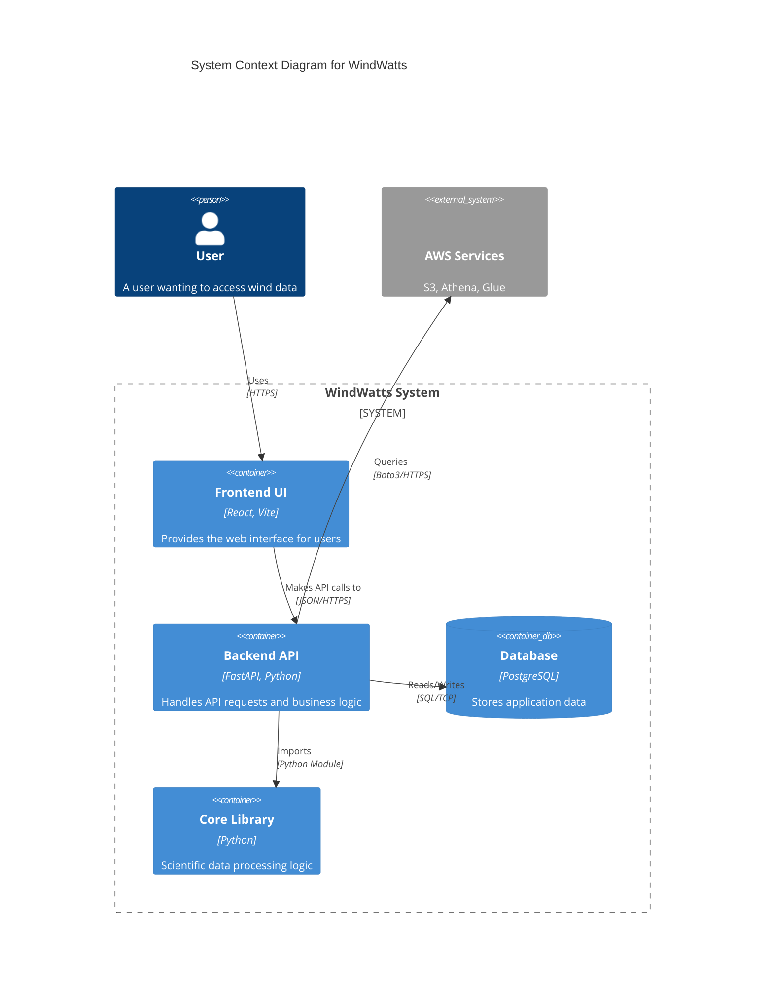

# System Overview

## Architecture

WindWatts is a monorepo consisting of:
-   **Frontend**: React application (`windwatts-ui`)
-   **Backend**: Python FastAPI application (`windwatts-api`)
-   **Core Library**: Data processing logic (`dw_tap`)

## Tech Stack

### Frontend
-   **Language**: TypeScript / JavaScript
-   **Framework**: React 19
-   **Build Tool**: Vite
-   **UI Library**: Material UI v7
-   **Runtime**: Node.js >= 22.14.0

### Backend
-   **Language**: Python 3.13
-   **Framework**: FastAPI [standard]
-   **Server**: Gunicorn / Uvicorn
-   **ORM**: SQLAlchemy
-   **Database**: PostgreSQL

### Infrastructure
-   **Containerization**: Docker
-   **Cloud Provider**: AWS (S3, Athena, Glue)
